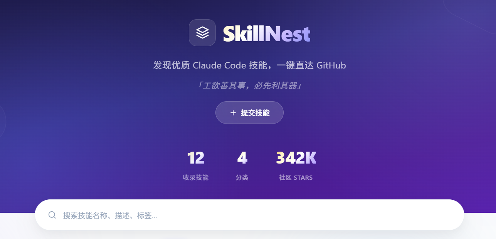

<p align="center">
  
</p>

<h1 align="center">SkillNest 🧩</h1>

<p align="center">
  <strong>工欲善其事，必先利其器</strong>
  <br>
  发现 · 分享 · 共建 Claude Code 技能生态
</p>

## 预览

<p align="center">
  
</p>

<p align="center">
  <a href="https://leavestring.github.io/SkillNest/"><strong>🔗 在线演示：leavestring.github.io/SkillNest</strong></a>
  <br>
  <sub>（初版静态网页，持续更新中。欢迎提交 Skill 或提出建议。）</sub>
</p>

<p align="center">
  <a href="#-什么是-skillnest">简介</a> ·
  <a href="#-如何使用">使用</a> ·
  <a href="#-提交技能">贡献</a> ·
  <a href="#-部署">部署</a> ·
  <a href="#-本地运行">本地运行</a>
</p>

---

## 🧩 什么是 SkillNest

SkillNest 是一个**社区驱动的 Claude Code 技能展示平台**，汇集了 GitHub 上最受欢迎的 Skills 仓库，并提供详细介绍、安装命令和直达链接。

### 收录的优质 Skills

| Skill | Stars | 简介 |
|-------|-------|------|
| [Superpowers](https://github.com/obra/superpowers) | 116K | 14 个核心技能的开发工作流包 |
| [Anthropic Skills](https://github.com/anthropics/skills) | 105K | Anthropic 官方出品 |
| [Karpathy Skills](https://github.com/forrestchang/andrej-karpathy-skills) | 61.6K | Karpathy 的 LLM 编程智慧 |
| [Antigravity](https://github.com/sickn33/antigravity-awesome-skills) | 14.7K | 1328+ 技能的最大技能库 |
| [Vercel Agent Skills](https://github.com/vercel-labs/agent-skills) | 12.5K | 44+ AI 工具通用安装器 |
| [Awesome Claude Skills](https://github.com/BehiSecc/awesome-claude-skills) | 8.1K | 300+ 技能精选目录 |
| [OpenSkills](https://github.com/numman-ali/openskills) | 7.2K | 通用技能加载器 |
| [Obsidian Skills](https://github.com/kepano/obsidian-skills) | 6.6K | Claude Code × Obsidian 整合 |
| [Awesome Claude Code](https://github.com/hesreallyhim/awesome-claude-code) | 3.7K | 生态工具精选集 |
| [SuperSkills](https://github.com/ariadoss/superskills) | 2.4K | 全栈+营销+设计合集 |
| [Supabase Agent Skills](https://github.com/supabase/agent-skills) | 2K | PostgreSQL 最佳实践 |
| [Trail of Bits Skills](https://github.com/trailofbits/skills) | 1.8K | 专业安全审计 |

---

## 🚀 如何使用

### 浏览技能

1. 打开 [SkillNest](https://leavestring.github.io/SkillNest/)
2. 首页以**卡片流**展示所有技能，按 Stars 从高到低排列
3. 在**搜索框**输入关键词（名称、标签、作者、描述），结果实时过滤
4. 点击顶部分类标签（全部 / 开发 / 工具 / 安全 / 官方）按类别筛选

### 查看详情

5. 点击任意卡片进入**详情页**，可看到：
   - 技能名称、一句话简介、作者、Stars
   - 详细功能说明
   - 核心功能清单
   - 安装命令（支持一键复制）
   - 同分类下的其他推荐技能
6. 点击 **「在 GitHub 查看」** 按钮直达 GitHub 仓库

### 安装技能

详情页提供安装命令，通常为以下两种方式之一：

```bash
# 方式一：git clone（将技能安装到 Claude Code 本地技能目录）
git clone https://github.com/user/repo .claude/skills/skill-name

# 方式二：npx 一键安装
npx skills add user/repo
```

---

## 📤 提交技能

我们欢迎每一位开发者分享好用的 Skills！无论是自己创建的还是发现的都可以提交。

### 提交流程（贡献者）

1. 打开 [提交页面](https://leavestring.github.io/SkillNest/skills/submit.html)
2. 填写表单，**必填项**：名称、简介、分类、GitHub 链接、详细介绍
3. **可选项**：作者、标签（逗号分隔，最多 5 个）、核心功能（每行一个）、安装命令、Stars 数量
4. 点击 **「预览效果」** 确认卡片样式符合预期
5. 点击 **「提交到 GitHub Issue」** → 浏览器自动打开一个新标签页，Issue 标题和正文已按模板填好
6. 确认信息无误后，在 Issue 页面点击 **Submit new issue** 完成提交
7. 等待站长审核收录

> 💡 提交的数据同时会保存到你的浏览器本地存储中，可立即在你的首页看到预览（仅自己可见）。

### 审核收录（站长）

收到 Issue 提交后：

1. 打开 `js/skillhub.js`，找到 `SKILLS_DATA` 数组
2. 将 Issue 中的信息整理为以下格式，**追加到数组末尾**：

```javascript
{
  "id": "skill-id",           // 唯一标识，建议用英文短横线格式
  "name": "技能名称",
  "tagline": "一句话简介",
  "description": "详细介绍...",
  "features": [               // 核心功能列表，每项用"名称：描述"格式
    "功能A：具体描述",
    "功能B：具体描述"
  ],
  "install": "git clone https://github.com/user/repo .claude/skills/name",
  "tags": ["标签1", "标签2", "标签3"],
  "category": "工具",         // 工具 / 开发 / 安全 / 配置 / 文档 / 其他
  "github": "https://github.com/user/repo",
  "author": "作者名",
  "stars": 1280,              // GitHub Stars 数量
  "license": "MIT",
  "updated": "2026-04"        // 最近更新（年月）
}
```

3. 提交并推送到 GitHub：

```bash
git add js/skillhub.js
git commit -m "收录技能：技能名称"
git push
```

4. GitHub Pages 会自动重新部署，一分钟内全站可见

---

## 🌐 部署

### GitHub Pages（推荐，免费）

**第一步：Fork**

点击右上角 Fork 按钮，将本仓库复制到你的 GitHub 账号下。

**第二步：开启 Pages**

1. 进入你 Fork 后的仓库 → Settings → Pages
2. **Source** 选择 `Deploy from a branch`
3. **Branch** 选择 `main`，目录选 `/ (root)`，点击 Save
4. 等待约 1 分钟，页面部署到 `https://你的用户名.github.io/SkillNest/`

**第三步：修改 SEO 信息**

全局搜索 `leavestring`，替换为你的 GitHub 用户名：

| 文件 | 需要修改的内容 |
|------|---------------|
| `index.html` | canonical URL、JSON-LD 结构化数据（`url`、`target`） |
| `sitemap.xml` | 所有 `<loc>` 中的 URL |
| `robots.txt` | `Sitemap:` 后的 URL |

> 💡 `skillhub.js` 中的仓库地址是**自动检测**的（运行时从浏览器 URL 提取），无需手动修改。如果使用自定义域名，在 `<script>` 标签上添加 `data-github-repo="用户名/仓库名"` 属性即可。

**第四步：验证**

- 访问 `https://你的用户名.github.io/SkillNest/` 确认页面正常
- 测试搜索、筛选、详情页是否正常
- 测试提交页面能否正确打开 GitHub Issue

### 其他平台

| 平台 | 操作 |
|------|------|
| **Vercel** | 导入 GitHub 仓库，自动识别为静态站点，点击 Deploy |
| **Cloudflare Pages** | 连接 GitHub → 选择仓库 → 构建设置留空 → Deploy |
| **Netlify** | 连接仓库或拖拽项目文件夹，自动部署 |

---

## 💻 本地运行

无需任何构建工具或依赖，纯静态 HTML/CSS/JS，直接打开即可。

```bash
# 1. 克隆仓库
git clone https://github.com/leavestring/SkillNest.git
cd SkillNest

# 2. 用浏览器打开首页
# Windows：
start index.html
# macOS：
open index.html
# Linux：
xdg-open index.html
```

> ⚠️ 本地用 `file://` 协议打开时，GitHub Issue 提交功能需要联网才能跳转。其他功能完全离线可用。

---

## 📂 项目结构

```
SkillNest/
├── index.html              # 首页：Hero 区 + 搜索框 + 分类筛选 + 卡片流
├── css/
│   └── skillhub.css        # 全站样式（渐变卡片、动画、响应式）
├── js/
│   └── skillhub.js         # 数据（SKILLS_DATA）+ 渲染引擎 + Issue 提交逻辑
├── skills/
│   ├── detail.html         # 技能详情页（动态渲染）
│   └── submit.html         # 社区投稿表单页
├── images/
│   └── preview.png         # 网页预览截图
├── sitemap.xml             # 搜索引擎站点地图（SEO）
├── robots.txt              # 爬虫规则（SEO）
└── README.md
```

### 核心文件说明

| 文件 | 作用 | 是否需要修改 |
|------|------|-------------|
| `js/skillhub.js` | 技能数据 + 全部交互逻辑 | 添加新 Skill 时编辑 `SKILLS_DATA` 数组 |
| `index.html` | 首页结构 + SEO 元数据 | Fork 后替换 canonical / JSON-LD 中的用户名 |
| `sitemap.xml` | 搜索引擎索引 | Fork 后替换所有 URL 中的用户名 |
| `css/skillhub.css` | 全局样式 | 一般不需要改，可自定义配色 |

---

## 🤝 贡献指南

### 方式一：提交 Skill（推荐，无需编程）

通过页面的[提交表单](https://leavestring.github.io/SkillNest/skills/submit.html)提交 → 自动生成 Issue → 站长审核收录。

### 方式二：直接 PR

1. Fork 本仓库
2. 编辑 `js/skillhub.js`，在 `SKILLS_DATA` 数组末尾追加新的 Skill 条目
3. 提交 PR，说明添加的技能及理由

### 方式三：反馈建议

在 Issues 中提出功能建议、Bug 反馈，或分享使用心得。

---

<p align="center">
  <sub>「积众人之智，成众人之事」</sub>
</p>
